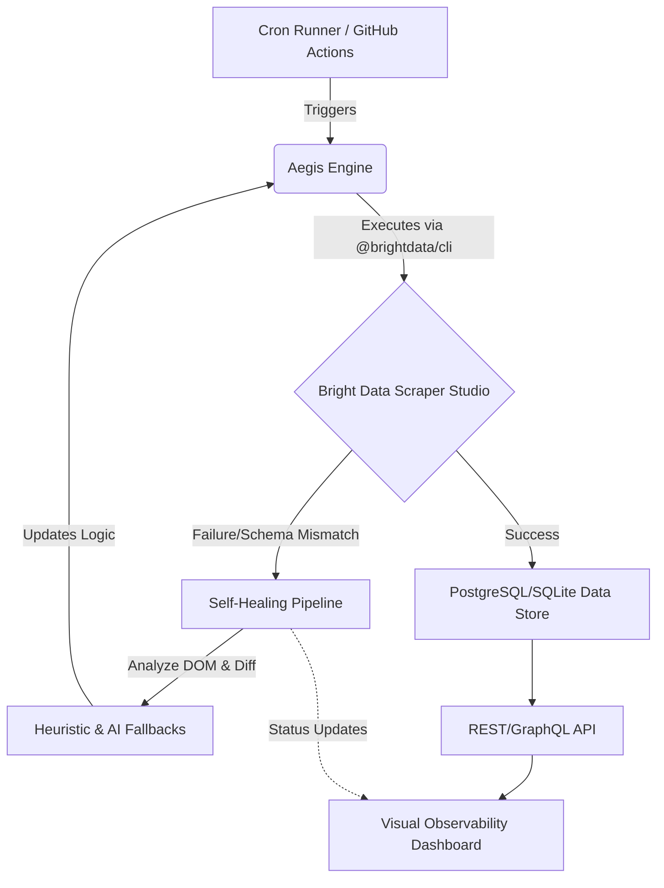

# System Architecture: AegisScrape

## Architectural Overview

AegisScrape employs a modular, event-driven architecture, separating the scraping execution layer from the observability and healing control planes.

## Bright Data Scraper Studio & `@brightdata/cli` Lifecycle

1. **Create**: Define initial scraper templates in the IDE.
2. **Run**: Trigger scrapers programmatically via CLI or API.
3. **Monitor**: Capture standard output, errors, and extracted data payloads.
4. **Heal**: If monitoring detects an anomaly, trigger the `bdata scraper heal` or custom healing scripts.
5. **Verify**: Run a validation pass on the healed scraper to ensure data integrity.

## Self-Healing Pipeline Engine

The core innovation of AegisScrape is its ability to recover from structural breaks:

- **DOM Diffing**: Compares the current broken DOM state with the last known good state to identify structural shifts.
- **Schema Validator**: Validates the JSON output. If required fields are missing, it signals a specific selector failure.
- **Fallback Heuristics**: Tries alternative selector strategies (e.g., XPath, fuzzy text matching) based on the broken selector's historical context.
- **AI Re-prompting**: If heuristics fail, packages the target HTML snippet and desired schema, prompting an LLM to generate the updated extraction logic.

## Automated CI/CD GitHub Actions Workflow

A robust CI/CD pipeline ensures the system is continuously monitored and updated:

- **Cron Runner**: Triggers scheduled scraper executions.
- **Auto-healing Agent**: Runs as a separate job that listens for failure events from the Cron Runner, executes the Self-Healing Engine, and creates a Pull Request with the updated scraper code if successful.
- **PR/Commit Automated Updates**: Ensures any healed code is reviewed (or auto-merged based on confidence score) and deployed, maintaining version control of the scraper logic.

## Downstream Consumers

- **Data Storage**: Uses PostgreSQL (production) or SQLite (local/testing) for persistent storage of scraped data and historical run metrics.
- **Real-time Visual Dashboard**: A React/Next.js frontend providing UI tracks for scraper health, run logs, and data previews.
- **REST / GraphQL APIs**: Endpoints for external applications to consume the cleaned, structured data.
